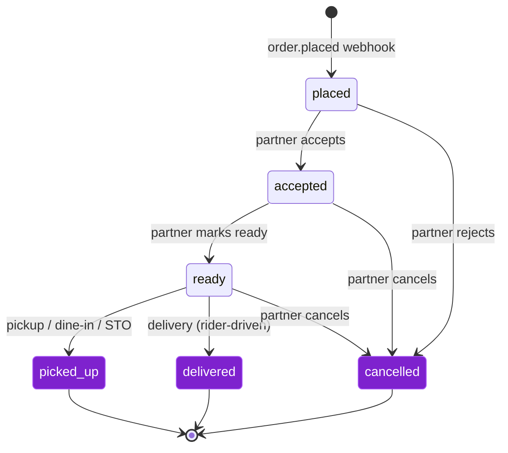

Outbound order webhooks (klikit → partner), the partner-side status callback API, the canonical order schema, lifecycle, and per-provider considerations.

## TL;DR

- **Outbound webhooks** carry every order event you care about: `order.placed`, `order.updated`, `order.cancelled`, `order.amended`.
- **Status callbacks** let you advance orders: accept, reject, ready, picked-up, cancel.
- **One canonical schema** abstracts over every delivery provider klikit integrates with — provider attribution is always explicit.
- **Read-only queries** are available if you prefer polling over subscribing (ERP/accounting use cases).

---

## 1. Order Lifecycle

klikit's canonical states:



<Note>
  Delivery completion (`delivered`) is **rider-driven**, not partner-driven. For delivery orders, do not call the status callback with `picked_up` — klikit will mark the order `delivered` when the rider/aggregator confirms handoff. Partners only set `picked_up` for pickup, dine-in, and scan-to-order flows.
</Note>

### Status enum (partner-facing)

The contract uses **string aliases**, not the internal int IDs. The integers are surfaced as `status_code` if you prefer them.

| Alias | Code | Meaning | Terminal? |
|---|---|---|---|
| `placed` | 1 | Order received from customer/aggregator, awaiting your accept | No |
| `accepted` | 2 | You have accepted the order, kitchen working | No |
| `cancelled` | 3 | Order cancelled (any party) — terminal | **Yes** |
| `ready` | 4 | Food prepared, ready for pickup/handoff | No |
| `delivered` | 5 | Order completed (delivery flow) — terminal | **Yes** |
| `picked_up` | 9 | Order completed (pickup / dine-in / STO flow) — terminal | **Yes** |

<Note>
  Use the string alias in every contract surface (request bodies, query filters, webhook payloads). `status_code` is provided alongside `status` purely as a convenience for partners that prefer integer state machines — both fields always agree.
</Note>

### Valid partner-driven transitions

| From | Allowed (via `PATCH /orders/{id}/status`) |
|---|---|
| `placed` | `accepted`, `cancelled` |
| `accepted` | `ready`, `cancelled` |
| `ready` | `picked_up` (pickup/dine-in only — delivery completion is rider-driven, not partner-driven), `cancelled` |
| `picked_up`, `delivered`, `cancelled` | None — terminal |

klikit will reject invalid transitions with `409 Conflict` and an `error.code` of `invalid_status_transition`.

---

## 2. Outbound Webhooks

Subscribed events are delivered to your registered `webhook_url` (see [Authentication §9](/authentication#9-onboarding-sequence)). Every event is HMAC-signed.

### Event envelope

```json
{
  "event_id": "01HX7K4J4M9V2P0Q5T8Z3W6Y1B",
  "event_type": "order.placed",
  "event_version": "1.0",
  "created_at": "2026-04-27T10:14:23Z",
  "business_id": 42,
  "data": { /* see schema below */ }
}
```

| Field | Notes |
|---|---|
| `event_id` | Stable UUID. Dedupe by this. |
| `event_type` | One of `order.placed`, `order.updated`, `order.cancelled`, `order.amended` |
| `event_version` | Schema version. Major bumps will fire alongside old version during deprecation window. |
| `created_at` | When klikit emitted the event (not when the order was placed). |
| `business_id` | The klikit business this event belongs to — useful when one partner serves multiple businesses. |

<Tip>
  Webhooks are delivered at-least-once. Always dedupe by `event_id` on your side — the same `event_id` arriving twice should be a no-op. klikit considers an event delivered after the first `2xx` response.
</Tip>

### Event types

| Event | When it fires | Replays expected? |
|---|---|---|
| `order.placed` | New order arrives in klikit (from any provider / channel) | At-least-once |
| `order.updated` | Order details change (customer note, delivery instructions, address — *not* status) | At-least-once |
| `order.cancelled` | Status moves to `cancelled` from any state, by any party | At-least-once |
| `order.amended` | Post-hoc correction — see §5 | Rarely; manual operator action |

**Note:** `order.placed` is fired **once** when the order first becomes visible. Subsequent status transitions (accept, ready, etc.) are not separate webhooks for v1 — you are the source of those transitions via the status callback API. If the **aggregator** drives a status change (e.g. customer cancels via the provider's app), an `order.cancelled` event fires.

---

## 3. Order Schema

The canonical order, used in `data` of `order.placed` / `order.updated` / `order.amended` webhooks and in `GET /v1/partner/orders/{id}` responses.

```jsonc
{
  "id": "ord_01HX7K4J4M9V2P0Q5T8Z3W6Y1B",  // klikit order id (opaque string)
  "short_id": "K7X9M2",                      // human-friendly, surfaced on receipts
  "external_id": "GF-20260427-12345",        // provider-side id
  "business_id": 42,
  "brand_id": 10,
  "branch_id": 100,

  "provider": {
    "id": 6,
    "name": "grabfood",
    "display_name": "GrabFood"
  },
  "channel": "marketplace",                  // marketplace | webshop | dine_in | scan_to_order

  "status": "placed",
  "status_code": 1,
  "status_history": [
    { "status": "placed", "at": "2026-04-27T10:14:20Z", "by": "system" }
  ],

  "order_type": "delivery",                  // pickup | delivery | dine_in | scan_to_order
  "placed_at": "2026-04-27T10:14:20Z",
  "scheduled_for": null,                     // ISO-8601 if scheduled order, else null

  "customer": {
    "name": "Aiko Tanaka",
    "phone": "+66800000000",
    "email": null,
    "address": {
      "line1": "123 Sukhumvit Soi 11",
      "line2": null,
      "city": "Bangkok",
      "postcode": "10110",
      "country": "TH",
      "latitude": 13.7440,
      "longitude": 100.5560,
      "instructions": "Leave at lobby"
    }
  },

  "items": [
    {
      "klikit_item_id": 12345,
      "partner_item_id": "POS-SKU-998",       // null if no mapping registered
      "sku": "BURGER-CLASSIC",
      "name": "Classic Cheeseburger",
      "quantity": 2,
      "unit_price": 199.00,
      "subtotal": 398.00,
      "modifiers": [
        {
          "klikit_modifier_id": 5500,
          "partner_modifier_id": null,
          "group_name": "Cheese",
          "name": "Extra cheddar",
          "unit_price": 30.00,
          "quantity": 1,
          "subtotal": 30.00
        }
      ],
      "special_instructions": "No pickles",
      "vat_amount": 27.86
    }
  ],

  "totals": {
    "currency": "THB",
    "currency_symbol": "฿",
    "subtotal": 428.00,
    "discount_amount": 0,
    "delivery_fee": 25.00,
    "service_fee": 10.00,
    "additional_fee": 0,
    "vat_amount": 30.66,
    "merchant_total": 463.00,                // what klikit/aggregator owes the merchant
    "customer_total": 463.00                 // what the customer paid
  },

  "payment": {
    "method": "card",                        // cash | card | wallet | invoice
    "channel_id": 1,
    "status": "paid",                        // paid | pending | failed | refunded
    "is_prepaid": true
  },

  "fulfilment": {
    "mode": "rider_delivery",                // self_pickup | rider_delivery | dine_in
    "rider": {
      "status": "searching",                 // searching | assigned | arrived | en_route | completed | failed
      "name": null,
      "phone": null,
      "vehicle": null
    },
    "pickup_at": null,
    "delivered_at": null
  },

  "metadata": {
    "cutlery": false,                        // optional cutlery preference
    "tax_id": null,                          // e.g. business tax id where required by jurisdiction
    "is_dine_in_table": null,                // table number for STO/dine-in
    "provider_metadata": {}                  // provider-specific opaque blob
  },

  "created_at": "2026-04-27T10:14:20Z",
  "updated_at": "2026-04-27T10:14:23Z"
}
```

### Field notes

- **`provider.id`** — see provider table in §6. Always present, including for klikit's direct webshop channel.
- **`partner_item_id` / `partner_modifier_id`** — populated only if you have registered mappings via [`mapping:write`](/menus#1-menu-mapping). `null` otherwise.
- **`status_history`** — at-least the `placed` entry; klikit appends each transition. `by` is one of `system`, `partner`, `aggregator`, `customer`, `operator`.
- **`metadata.provider_metadata`** — escape hatch for provider-specific fields klikit doesn't model canonically. Safe to ignore; advanced integrations can use it.
- **PII** is exposed raw in v1 (customer name, phone, address). Tokenized references behind a `pii:read` scope are on the roadmap.

---

## 4. Status Callback API

```http
PATCH /v1/partner/orders/{order_id}/status HTTP/1.1
Authorization: Bearer <token>
Idempotency-Key: <uuid>
Content-Type: application/json

{
  "status": "accepted",
  "reason_code": null,
  "estimated_ready_at": "2026-04-27T10:30:00Z",
  "note": null
}
```

### Body fields

| Field | Required when | Notes |
|---|---|---|
| `status` | always | One of `accepted`, `cancelled`, `ready`, `picked_up`. (`placed`, `delivered` are not partner-settable.) |
| `reason_code` | `status: "cancelled"` | Enumerated (see §4.1). 400 if missing on cancel. |
| `estimated_ready_at` | optional on `accepted` | ISO-8601. Surfaced to the customer on the aggregator app where supported. |
| `note` | optional | Free text. Not always forwarded to the upstream provider. |

### Response

```json
{
  "id": "ord_01HX7K4J4M9V2P0Q5T8Z3W6Y1B",
  "status": "accepted",
  "status_code": 2,
  "updated_at": "2026-04-27T10:14:31Z",
  "provider_propagation": {
    "state": "queued",
    "attempted_at": null
  }
}
```

`provider_propagation` is best-effort feedback on whether klikit has notified the upstream provider. State is one of `queued`, `propagated`, `failed`, or `not_required`. `not_required` means the order is on a channel that doesn't need provider notification (e.g. klikit's direct webshop channel).

### Errors

| Status | `error.code` | When |
|---|---|---|
| 400 | `validation_error` | Missing fields / invalid enum |
| 401 | `unauthenticated` | Token missing/expired |
| 403 | `insufficient_scope` | Token lacks `orders:write` |
| 404 | `order_not_found` | Unknown `order_id` *or* order belongs to another business |
| 409 | `invalid_status_transition` | E.g. `accepted → placed` |
| 409 | `provider_rejected_cancel` | Aggregator refuses cancel (rider already assigned) |
| 422 | `missing_cancel_reason` | `cancelled` without `reason_code` |

<Warning>
  `409 provider_rejected_cancel` cannot be retried client-side — the aggregator has refused the cancellation (typically because a rider is already en route). Operators must escalate to klikit support to coordinate the cancel directly with the provider.
</Warning>

### 4.1 Cancel reasons

```http
GET /v1/partner/orders/cancel-reasons
```

Returns the cancel reason enumeration. Sample:

```json
{
  "data": [
    { "code": "out_of_items",            "label": "Items unavailable" },
    { "code": "kitchen_closed",          "label": "Kitchen is closed" },
    { "code": "store_too_busy",          "label": "Store is too busy" },
    { "code": "customer_requested",      "label": "Customer requested cancellation" },
    { "code": "cannot_complete_request", "label": "Cannot fulfil customer's special request" },
    { "code": "system_error",            "label": "System / technical issue" },
    { "code": "other",                   "label": "Other (use note)" }
  ]
}
```

klikit maps the canonical `code` to the appropriate provider-specific code automatically.

---

## 5. Order Reads (Polling Alternative)

For partners that prefer pull over push (ERP, reconciliation jobs):

```http
GET /v1/partner/orders?status=delivered&placed_from=2026-04-27T00:00:00Z&placed_to=2026-04-27T23:59:59Z&limit=100&cursor=<opaque>
```

| Query param | Notes |
|---|---|
| `status` | Filter (one or comma-separated) |
| `placed_from` / `placed_to` | ISO-8601 time bounds |
| `provider_id` | Filter by provider |
| `branch_id` / `brand_id` | Scope to a branch/brand |
| `cursor` | Opaque pagination cursor from previous response |
| `limit` | Default 50, max 200 |

Response is a paginated list of order objects. Use the `X-Klikit-Next-Cursor` header for pagination.

<Tip>
  Cursors are **opaque** — do not parse, decode, or persist them across deploys. Treat each cursor as a single-use token: read it from `X-Klikit-Next-Cursor`, pass it back as the `cursor` query param on the next request, and discard.
</Tip>

```http
GET /v1/partner/orders/{order_id}
```

Returns a single order using the same schema as the webhook `data` field.

---

## 6. Provider Reference

```json
{
  "data": [
    { "id": 1,  "name": "klikit",     "display_name": "klikit (webshop / direct)" },
    { "id": 2,  "name": "uber_eats",  "display_name": "Uber Eats" },
    { "id": 3,  "name": "deliveroo",  "display_name": "Deliveroo" },
    { "id": 6,  "name": "grabfood",   "display_name": "GrabFood" },
    { "id": 7,  "name": "foodpanda",  "display_name": "Foodpanda" },
    { "id": 9,  "name": "gofood",     "display_name": "GoFood" },
    { "id": 11, "name": "shopeefood", "display_name": "ShopeeFood" },
    { "id": 12, "name": "demaecan",   "display_name": "Demaecan" },
    { "id": 13, "name": "pickaroo",   "display_name": "Pickaroo" },
    { "id": 14, "name": "wolt",       "display_name": "Wolt" },
    { "id": 16, "name": "tiktok",     "display_name": "TikTok Shop" },
    { "id": 17, "name": "maxim",      "display_name": "Maxim" }
  ]
}
```

Endpoint: `GET /v1/partner/providers`. Refresh client-side every few hours; new providers are added rarely.

---

## 7. Per-Provider Considerations

These are the differences that bleed through despite the canonical schema.

| Concern | Notes |
|---|---|
| **Order types** | Not all providers support all types. `dine_in` and `scan_to_order` are limited to certain providers — check `order_type` on each order rather than assuming. |
| **Cancellation latitude** | Some providers reject partner-driven cancellations once a rider is assigned. The status callback returns `409 provider_rejected_cancel` — escalate to klikit support if needed. |
| **Live modification** | Not supported by providers. To change items/quantity on an in-flight order: cancel + re-create on a different channel. |
| **Currency / pricing precision** | All amounts are decimals in the order's currency unit (THB 463.00, not 46300). klikit normalises any provider-specific representations behind the scenes. |
| **Tax IDs** | Where a jurisdiction requires customer-supplied tax IDs (e.g. business invoices), they appear at `metadata.tax_id`. |
| **Cutlery preferences** | Where a provider supports cutlery preferences, normalised to `metadata.cutlery: true/false`. |
| **Scheduled orders** | `scheduled_for` is set; do not begin preparation until `(scheduled_for - lead_time)`. Lead time is configurable on your side. |
| **Replays** | Webhooks can fire more than once. Always dedupe by `event_id`. The order itself is idempotent — `order.placed` for the same `id` twice should be a no-op. |

<Warning>
  **Live modification of in-flight orders is not supported** by any aggregator. Once an order is `accepted`, you cannot change items, quantities, or modifiers via the API. The only workaround is to `cancel` the existing order (with an appropriate `reason_code`) and have the customer re-place on a different channel.
</Warning>

---

## 8. Failure Modes

| Scenario | Behaviour |
|---|---|
| Your endpoint returns 5xx | klikit retries per [Authentication §5](/authentication#5-webhook-retry-policy) |
| Your endpoint timeout (`>10s`) | Counted as failure; retried |
| Your endpoint returns 4xx | klikit retries (4xx may be transient); after final attempt → dead-letter |
| Duplicate `event_id` delivered | Dedupe on your side; klikit considers it delivered after first 2xx |
| Status callback fails to propagate to provider | `provider_propagation.state: "failed"` in response. The klikit-side state still transitions; klikit retries provider notification asynchronously. |
| Order amended after you have already accepted | An `order.amended` webhook fires with the corrected payload. Reconcile (e.g. update kitchen ticket). |

---

## See Also

- [Authentication](/authentication) — how to get a token, how to verify webhooks
- [Menus](/menus) — Menu Mapping (so `partner_item_id` populates on orders)
- [OpenAPI Spec](./openapi/orders.yaml) — machine-readable spec
